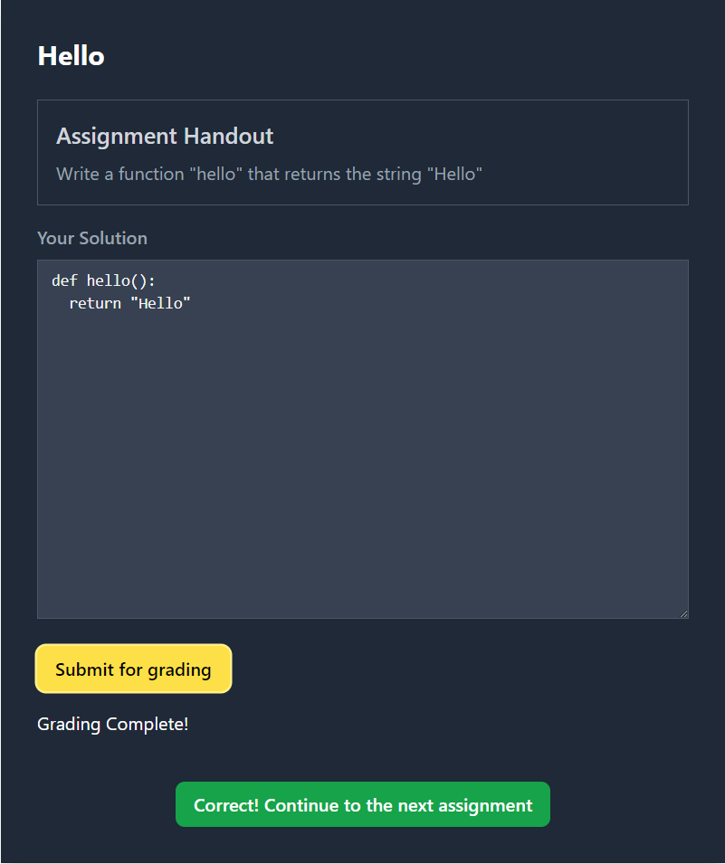

# Project overview:  
   
This web-application presents the user python programming assignments. User can type the solution to a textbox. The backend spins up a docker container for grading the users solution and offers feedback. If the solution is correct, the user is presented a new assignment:  
   
  
  

## Overview of the desing:  
  
### User-interface (programming-ui):  
  
- The ui is implemented as a SPA-app using Astro and Svelte frameworks.  
  
- Using the app:  
  
    When a user opens the application frontpage a programming assingment is presented. User can then type the solution to a textbox and submit it. When a user submits the solution, the status of the grading is polled and the feedback is rendered when the grading finishes. If the solution passes the tests done by the grader-api a button for retrieving the next assingment appears. User can then press the button and the next assingment is presented. If the solution is incorrect, the feedback of the tests are shown to the user.  
  
User is identified with a Universally Unique Identifier (uuid). The assingments are presented in a spesific order and the user can return to the next unsolved assigment if he/she for example closes the browser.  
  
### Backend (programming-api)  
  
    - The backend is a simple deno-application that handles the requests sent from the ui and from the grader-api.  
    - The app uses a postgresql database for saving the data.  
    - The database queries are cached to improve performance.  
    - The solution feedback that is sent from the grader-api is checked for correct or incorrect solution and then saved to the database.  
  
### grader-api  
  
- When a solution is submitted, the programming-api sends the solution to be graded by the grader-api. 
- The solutions are added to a queue which is processed sequentially. 
- The grader-api creates a docker container and which runs tests against the solution and the sends the feedback back to the programming-api.  
  
### Possible improvements:  
  
- **programming-ui:**  
    - The polling could be switched to server-sent events.  
    - Implementing the possibility to use TAB inside the textbox  
    - rows in the textbox are numbered and highlighted with different colours.  
  
- **programming-api:**  
    - The indexing of the database could be tested, studied and possibly improved  
  
- **grader-api:**  
    - The queue could be implemented in a better way. It is now implemented as a simple js-array.

### Before running the application:  
  
1. From `programming-ui`-folder download the dependencies by running the command:  
`npm install`  
  
2. From `grader-image`-folder build the docker image by running the command:  
`docker build -t grader-image .`  
  
## Running the production build:  
  
### Starting the app:  
From the root-folder of the project the app is started as a daemon with the production configuration by running the command:  
`docker compose -f docker-compose.prod.yml up -d`  
  
### Shutdown:  
docker compose down  
  
### Running the end-to-end playwright tests:  
The end-to-end playwright tests can be found in `/e2e-playwright/tests` -folder  
  
1. From the root-folder of the project the app is started with the dev configuration by running the command:  
`docker compose -f docker-compose.yml up`  
  
2. Run the tests with a command:  
`docker compose -f docker-compose.yml run --rm --entrypoint=npx playwright playwright test`  
  
3. Shutdown:   
`docker compose -f docker-compose.yml down`  
  
### Running the k6 performance tests:  
  
With k6 installed and the application running, tests can by found from the `k6`-folder.  
Tests are run with the command:  
`k6 run [testfilename]`    

